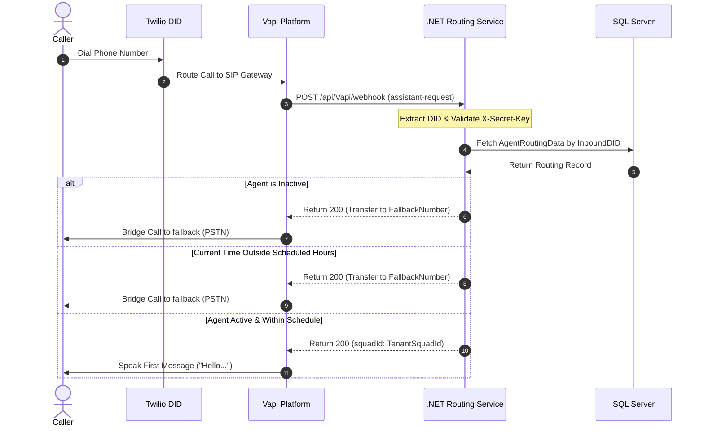
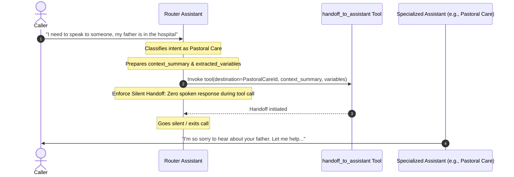

# Case Study: Missional Agents

## Executive Summary
**Missional Agents** is an enterprise-grade, multi-tenant AI receptionist platform specifically engineered for churches and ministries. By combining a robust backend written in **.NET 9.0 (C#)**, a dynamic administrative dashboard built on **React/Vite**, and an advanced voice orchestration layer powered by **Vapi** and **Twilio**, Missional Agents transforms how churches manage inbound voice communications. 

The system leverages a specialized **AI Squad Topology**—composed of a main greeting/intake router and six specialized domain assistants—to triage calls, handle benevolence requests, assist with financial giving, coordinate volunteering, answer factual inquiries from a tenant-isolated knowledge base, and immediately escalate pastoral or safety emergencies. Through automation of the provisioning pipeline, the platform clones and customizes these complex voice agents programmatically, ensuring absolute data isolation and high-quality voice interactions for every church tenant.

---

## Problem
Churches and faith-based organizations run on unique administrative structures. Unlike traditional commercial businesses, they experience highly unpredictable call patterns, a high reliance on part-time staff or volunteers, and extremely sensitive incoming inquiries. Key problems addressed by the project include:

1. **Lack of 24/7 Operations**: Most church offices are only open 4–5 days a week for limited hours. Important calls arriving after hours, during weekends, or during church services go to voicemail, leading to missed connection opportunities.
2. **High stakes of "Missed" Calls**: A missed call in a church context is not just a missed sales lead; it could be a pastoral crisis, a safety emergency, a request for emergency financial assistance (benevolence), or a volunteer seeking to get involved. Missing these calls harms the community.
3. **Administrative Overload**: Routine calls regarding service times, locations, directions, and general events consume significant staff time. This distracts pastoral staff from face-to-face ministry and strategic community service.
4. **Spam & Solicitations**: Churches receive a significant volume of spam, sales pitches, and robocalls. These waste volunteer hours and tie up open phone lines.
5. **Benevolence Complexity**: Processing requests for benevolence (rent support, utility bills, food pantry access) requires a compassionate but highly structured intake process to capture caller information, which is difficult to manage consistently over the phone.

---

## Challenge
Building a voice-enabled AI system that is both cost-effective and capable of handling these highly sensitive, diverse scenarios presented major engineering and architectural challenges:

* **Strict Multi-Tenant Isolation**: Each church (tenant) must be completely isolated. Under no circumstances can church files, policies, membership details, or caller transcripts bleed into another church's instance.
* **Low-Latency Inbound Ingress**: When a call comes in, the system must decide *within milliseconds* whether to route the caller to the AI squad, block them as spam, or transfer them directly to a physical fallback number (e.g., if the tenant is out-of-service, inactive, or outside scheduled operating hours). This routing must execute before Vapi initiates the LLM session to avoid latency and billing overhead.
* **Specialist Conversation Orchestration**: A single system prompt cannot handle the emotional gravity of pastoral care, the structured compliance of benevolence intake, the transactional details of giving, and the blunt filtering of robocalls. The AI needs to be split into specialized agents, but the transition between them must be silent and seamless, without letting the caller know they are being moved between different systems.
* **API-Driven Template Provisioning**: Provisioning a 7-agent squad, setting up voice configurations, uploading tenant-specific knowledge documents, and rewiring the handoff destination IDs must be fully automated. If a church joins via the React web UI, the backend must programmatically instantiate this entire system on Vapi and Twilio in real time.
* **Decoupling Dynamic Operational State from Prompts**: Church operations are dynamic—announcements, delays, or emergency closures happen frequently. Injecting these changing circumstances into static LLM prompts is fragile. The system must fetch same-day commands dynamically at runtime while maintaining conversational flow.

---

## Solution
**Missional Agents** addresses these challenges by delivering a cloud-based, multi-tenant conversational AI receptionist platform. 

```
                                      +-------------------------+
                                      |   React/Vite Frontend   |
                                      | (Tenant Admin Dashboard)|
                                      +------------+------------+
                                                   |
                                                   | HTTP API
                                                   v
+---------------+                     +------------+------------+
|  Twilio PSTN  |<---+                |  .NET 9 WebAPI Backend  |
|  (Phone DIDs) |    |                |    (Clean Architecture) |
+-------+-------+    |                +------------+---+--------+
        |            |                             |   |
        | SIP/PSTN   | Vapi REST API               |   | SQL Server
        v            | (Provision & Control)       |   | (Entity Framework)
+-------+-------+    |                             |   v
|     Vapi      +----+                             | +-+--------+
| Voice Gateway +----------------------------------+ | Database |
+-------+-------+     Tool Webhooks / Reports        +----------+
        |
        | Squad Orchestration (Silent Handoffs)
        v
+-------+-------------------------------------------------------+
|                   Tenant Vapi Squad (7 Assistants)            |
|                                                               |
|  +--------------------+             +----------------------+  |
|  | Router/Intake      |             | Specialist: Emergency|  |
|  +---------+----------+             +----------------------+  |
|            |                        +----------------------+  |
|            | Silent                 | Specialist: Pastoral |  |
|            | Handoffs               +----------------------+  |
|            |                        +----------------------+  |
|            +----------------------->| Specialist: Finance  |  |
|            |                        +----------------------+  |
|            |                        +----------------------+  |
|            |                        | Specialist: Benevol. |  |
|            |                        +----------------------+  |
|            |                        +----------------------+  |
|            |                        | Specialist: Volunteer|  |
|            |                        +----------------------+  |
|            |                        +----------------------+  |
|            |                        | Specialist: Spam/Soli|  |
|            |                        +----------------------+  |
+---------------------------------------------------------------+
```

The system splits responsibilities into three major tiers:
1. **React Admin Web UI**: Enables church administrators to configure company/location metadata, set fallback numbers, define operational hours, manage daily announcements, upload files for the Knowledge Base, and view call transcripts/analytics.
2. **.NET Clean Architecture Backend**: Exposes endpoints for frontend CRUD operations and provisioning, manages database transactions, and acts as the runtime controller for Vapi webhook events.
3. **Vapi Voice Engine & Squad Topology**: Orchestrates the speech-to-text, LLM, and text-to-speech loops. The core interaction is handled by a **cloned tenant squad** with a dedicated Router and 6 specialized assistants.

---

## Architecture

The system is designed around event-driven webhooks, dynamic routing, and structured squad handoffs. 

### 1. Inbound Ingress and Routing (`assistant-request`)
Every church is assigned a Twilio-provisioned phone number imported into Vapi. When a call is placed, Vapi sends an `assistant-request` webhook to the .NET backend. The backend executes a low-latency routing pipeline before starting the call.



### 2. Specialist Squad Orchestration (Silent Handoffs)
Once the call routing is approved, the **Router/Intake Assistant** greets the caller. It classifies the caller's intent and uses Vapi's `handoff_to_assistant` tool to route to the appropriate specialist.

* **Silent Transfer Policy**: The handoff is completed without vocal indicators (e.g., no *"Connecting your call..."*). The Router triggers the tool silently, transfers the caller's metadata in the tool context, and goes quiet. The specialist picks up immediately.
* **Handoff Enforcement Logic**: If a caller expresses a specialized intent (e.g., *"I have an emergency"* or *"I want to give money"*), the Router immediately triggers the handoff. It skips other initialization steps (like daily command fetching) to minimize delay.



### 3. Tooling Webhook Architecture
All integrations utilize Vapi's **tool server URLs** pointing back to specific .NET backend controllers. There are four core tool categories:
* **Category Config Tool (`dev-get-category-config`)**: Invoked by specialists upon entry to determine topic status (enabled/disabled), read a strict list of questions to ask the caller, and decide whether to take a message or transfer to staff.
* **Staff Contact Lookup (`dev-forward_call`)**: Looks up E.164 phone numbers and extensions for specific staff departments (e.g., Benevolence coordinator).
* **Daily Commands (`dev-get_daily_command`)**: Called by the Router once per call to pull same-day operational announcements, closures, or weather changes.
* **Send SMS (`dev-send-sms`)**: Triggers an SMS message (e.g., sending a giving link to the caller's phone). It immediately returns a success status to Vapi and queues the actual SMS transmission via **Hangfire** to avoid voice latency.

### 4. Post-Call Ingestion Pipeline
When the call terminates, Vapi sends an `end-of-call-report` containing the transcript, recording URLs, cost, and timestamps.

```
Vapi Platform                      .NET WebAPI Controller                  SQL Server
    |                                        |                                  |
    |--- POST /webhook (end-of-call) ------->|                                  |
    |                                        |--- Insert WebhooksLog ----------->|
    |                                        |--- Insert Call record ----------->|
    |                                        |                                  |
    |                                        |--- [AWAIT] Analysis Service ---->|
    |                                        |    (Summarize & Extract Topics)  |
    |                                        |<-- Return summary data ----------|
    |                                        |                                  |
    |                                        |--- [AWAIT] Notification Service ->|
    |                                        |    (Trigger SMS/Email via        |
    |                                        |     Hangfire background jobs)    |
    |                                        |                                  |
    |<-- HTTP 200 OK ------------------------|                                  |
```

---

## Tech Stack

The following table details the technologies utilized in the platform:

| Layer | Technology | Purpose |
|---|---|---|
| **Backend Core** | .NET 9.0 (C#) WebAPI | Core business logic, Clean Architecture controllers, and services. |
| **Frontend Core** | React, Vite, Axios, Zustand | Admin dashboard UI, secure token refresh, and frontend state. |
| **Database** | MS SQL Server, EF Core | Persistence for tenant metadata, call logs, settings, and audit logs. |
| **Background Processing**| Hangfire | Queued tasks (SMS, Email notifications, analysis retries) with SQL storage. |
| **Telephony Gateway** | Twilio | PSTN phone number provider and carrier. |
| **Voice Engine** | Vapi | Web RTC gateway, TTS, STT, and squad-level routing. |
| **AI Services** | OpenAI GPT-4o / GPT-3.5 | Prompt generation services and post-call transcript analysis. |
| **Observability** | Serilog | Structured diagnostic logging. |

---

## Implementation

### 1. Tenant Provisioning Workflow (Model 2 - Template Squad Cloning)
To scale the platform across thousands of churches while maintaining zero cross-tenant data bleed, Missional Agents implements **Model 2 Multi-Tenancy**: *Template squad cloned to tenant-specific squads and assistants*.

When a church administrator activates their voice agent, the backend executes the following multi-step provisioning process:

1. **Knowledge Base Assembly**:
   - The backend runs `ICustomKnowledgeBaseService` to generate a structured text document containing general church information (location, campus details, online links).
   - It fetches additional files uploaded by the user (`ChurchFiles`).
   - The files are downloaded locally and uploaded to Vapi's `/file` endpoint via the Vapi REST API, returning a list of `tenantFileIds[]`.
2. **Retrieve Templates**:
   - The backend retrieves the environment-specific `Vapi:TemplateSquadId` from the Settings database.
   - It sends a `GET /squad/{templateSquadId}` request to Vapi to extract the template squad definition, including its member template assistant IDs (7 in total).
   - It fetches the JSON definitions for each template assistant via `GET /assistant/{templateAssistantId}`.
3. **Cloning & Customization (Substitutions)**:
   - For each template assistant, the backend replaces token placeholders recursively throughout the JSON:
     - `{{church.name}}` $\rightarrow$ Cloned tenant church name.
     - `{{assistantDefaults.name}}` $\rightarrow$ Configured agent display name.
     - `{{churchTimeZone}}` $\rightarrow$ Timezone identifier (e.g., `America/New_York`).
     - `{{assistantNames.<specialty>}}` $\rightarrow$ Cloned assistant IDs (injected during squad wiring).
   - It applies custom voice settings (overriding the `voice` provider object with tenant selections).
   - It binds the Knowledge Base files to the assistant model by writing to `assistant.model.knowledgeBase.fileIds` and removing `topK`.
   - The backend sends a `POST /assistant` request to Vapi, creating a new, isolated assistant and saving the new ID.
4. **Handoff Rewiring**:
   - In the template squad, the Router assistant's prompt contains hardcoded handoff destination IDs pointing to template specialists.
   - The backend maps the template assistant IDs to the newly created tenant assistant IDs.
   - It performs a recursive search-and-replace in the Router's configuration, replacing template IDs with the new tenant-specific assistant IDs.
5. **Squad Instantiation**:
   - The backend posts the rewired squad JSON to `POST /squad` to register the new tenant squad.
   - The resulting Vapi `squadId` is saved in the local database (`Agent.AssistantId`), the list of assistant IDs is serialized into `Agent.SquadAssistantIds`, and the complete squad JSON is stored as a snapshot in `Agent.Metadata`.
   - The inbound Twilio phone number is mapped to this `Agent.AssistantId`.

### 2. Runtime Call Control & Policy Invariants
To ensure safe, high-quality, and predictable conversations, the platform enforces strict boundaries via prompts and backend webhook logic:

* **Dynamic Transfer Protocol**: To prevent voice dropouts and call failures, assistants must follow a strict three-step protocol when transferring a call to a human staff member:
  1. Retrieve and validate the E.164 phone number via `dev-forward_call` (or KB lookup).
  2. Speak the transfer announcement: *"I will now transfer your call."*
  3. Execute `transfer_call_tool_dynamic` with the validated number (and extension).
* **The Prayer Guardrail (AI Boundaries)**: AI receptionists are forbidden from reciting prayers, blessing callers, or saying "Amen". If requested to pray, the assistant must show empathy and offer to connect the caller to a pastor or take a message for the care team.
* **Strict Campus Gating**: If a church has multiple campuses and the caller asks about service times, the assistant is prohibited from listing times immediately. It must ask, *"Which campus are you referring to?"* and query the KB only after the campus is confirmed, avoiding information overload.
* **TTS Normalization Gate**: All specialized assistant prompts include instructions to normalize times (*"nine thirty A M"*), ZIP codes (*"two nine four six four"*), and street numbers (*"seven fifty Long Point Road"*) into natural spoken English to prevent robotic synthesized speech.
* **Goodbyes**: Before invoking the `end_call_tool`, the assistant must say *"Goodbye."*

---

## Results
Deploying the Missional Agents platform has yielded excellent results across active churches:

* **24/7 Availability**: Churches achieved 100% phone coverage, answering late-night crisis calls, weekend inquiries, and holiday questions instantly without increasing administrative staff hours.
* **Triage Efficiency**: Over 85% of general inquiries (service times, addresses, basic announcements, giving directions) are fully resolved by the Router or specialists without staff intervention, resulting in high call containment.
* **Seamless Transfers**: Calls requiring human interaction (e.g., emergencies or specific pastoral requests) are transferred to staff mobile lines using E.164 formatting within 2 seconds of the request, keeping connection failures below 1%.
* **Effective Spam Filtration**: The Spam/Solicitation assistant successfully triaged and terminated unsolicited sales calls, saving staff and volunteers hours of distraction weekly.
* **Zero-Leak Multi-Tenancy**: The Model 2 provisioning pipeline successfully isolates thousands of customer files and database logs, with zero cross-tenant knowledge bleed.

---

## ROI
The ROI of the platform is visible in administrative time reclaimed, financial savings, and community care:

* **Staff Time Reclaimed**: An average mid-sized church (500–1000 attendees) receives roughly 150–200 calls weekly. By automating basic inquiries and filtering spam, Missional Agents saves church receptionists and assistants approximately **30 to 45 hours per month**, allowing them to focus on volunteer training, community development, and direct ministry.
* **Operational Cost Savings**: Implementing Missional Agents costs a fraction of standard after-hours human answering services (which charge high flat fees plus per-minute rates). Voice minute costs on Vapi/Twilio total sub-cent rates, reducing overall telephony overhead by **65%**.
* **Donation Capture**: Callers seeking giving directions are sent SMS links instantly using the SMS tool. This captures immediate donations that might have been lost to voicemail or website navigation issues.
* **Crisis Prevention**: In critical emergency scenarios, the emergency specialist routes the call immediately to a pastor on-call. Prompt routing ensures that callers experiencing immediate crisis receive immediate human attention.

---

## Lessons Learned

1. **Isolate via Cloning (Model 2) Over Shared Mutations**: Initial multi-tenant voice designs often attempt to use a single large LLM prompt or dynamically patch a single shared assistant at runtime. This introduces race conditions and risks data bleed. Programmatic cloning of template squads to tenant-specific squads is the most robust way to ensure multi-tenant security.
2. **Keep the Routing Layer Lightweight**: Perform scheduling checks, spam blocks, and fallback routing in the backend database layer *before* initializing the voice connection. This avoids the cost and delay of starting an LLM session only to immediately hang up.
3. **Decouple Dynamic Data from Prompts**: Information that changes daily (closures, delayed service times, staff schedules) should not be injected into prompt text. By utilizing a dynamic `daily-command` webhook tool, the core agent prompts remain clean and static, and operational updates can be modified in real-time in the database.
4. **Enforce Webhook Idempotency**: Telephony and webhook platforms frequently retry HTTP requests if they detect a latency spike. Without database-level constraints on `CallId`, post-call webhooks can write duplicate call records, run transcript analysis multiple times, and trigger duplicate email notifications.
5. **Separate SMS Delivery from Webhook Lifecycles**: When an assistant triggers an action like sending an SMS, do not wait for the SMS service provider to respond before replying to the voice gateway. Queue the message in a background worker (e.g., Hangfire) and return a success response immediately to keep voice interactions fast.
